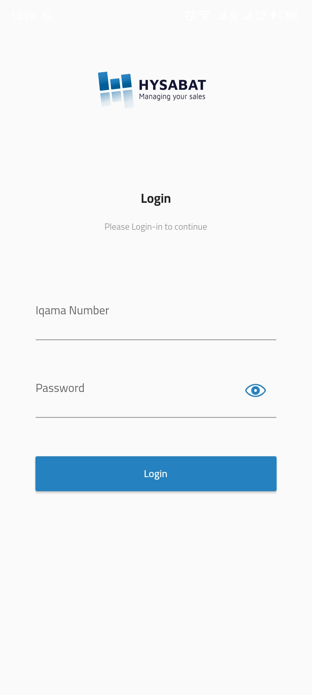
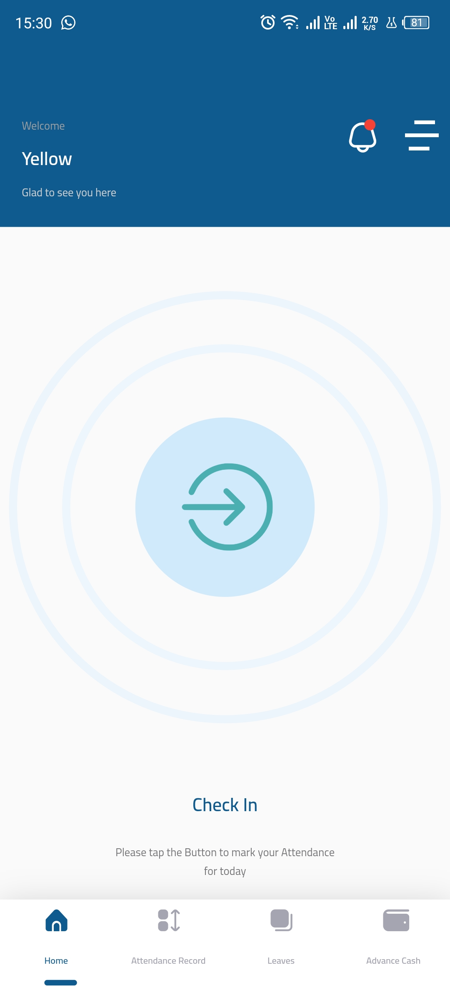
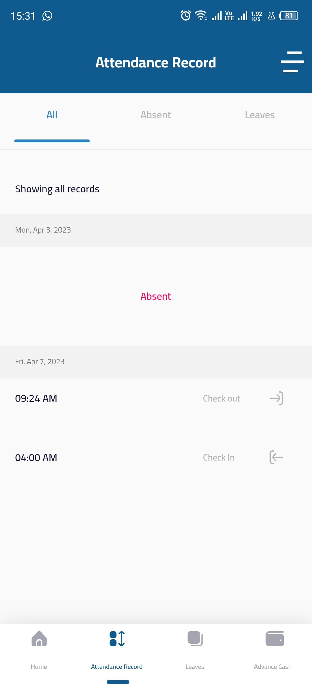
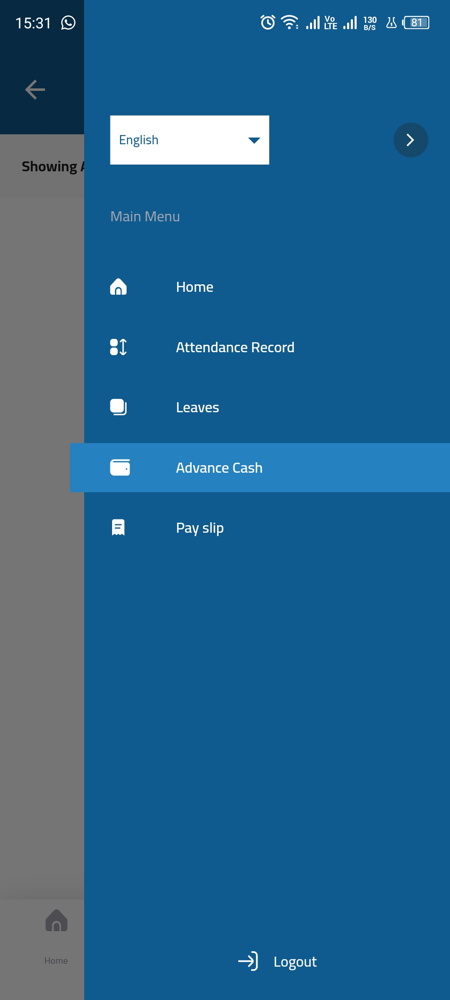
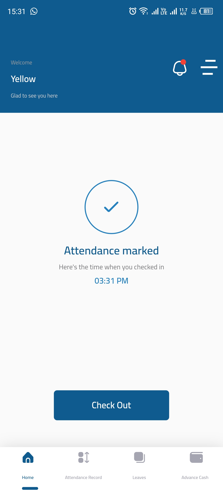
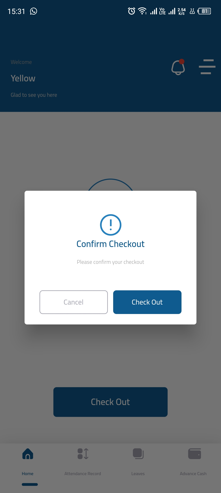
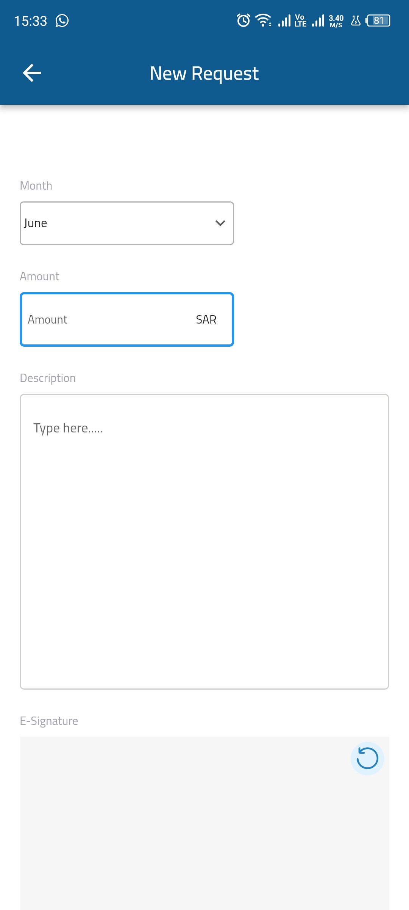
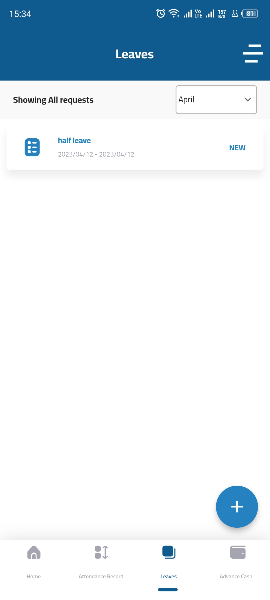
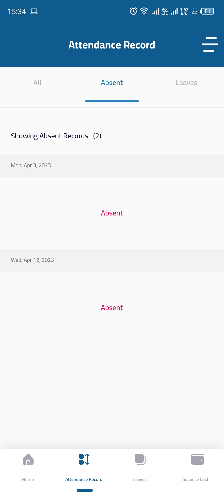
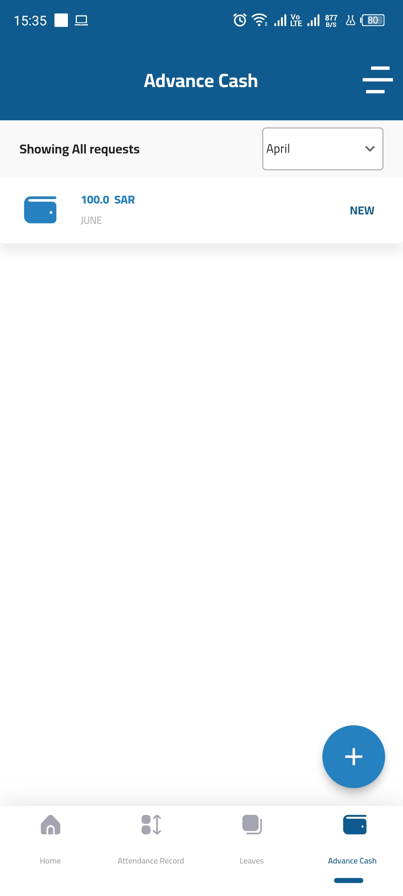

# HRM-Employee-App

INTRODUCTION

The HRM mobile app is a part of a larger human resource management system designed to streamline HR operations and improve the employee experience. The app is specifically developed for employees and includes features such as attendance marking, leave application, advance application, and payslip receipt. These features are designed to provide employees with a user-friendly and convenient way to manage their HR tasks from their mobile device.

SYSTEM FEATURES

1. Login
2. Attendance
3. Leave Request
4. Advance Management
5. Multi-Language

TECHNICALITIES/TOOLS USED
1. Flutter
2. Cubit State Management
3. MVVM Design Pattern
4. GraphQL APIs
5. .NET Backend
6. IP Restriction

SCREENSHOTS

         

INSTALLATION LINK

APK Link: https://drive.google.com/file/d/1CZbWehSwb00mtVi_bUGmYBf9bp6W7XqD/view?usp=sharing

Credentials
iqama number: 013416546
Password: Admin@123

                                                              THANKS
